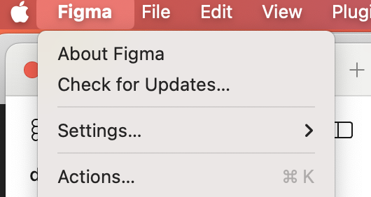
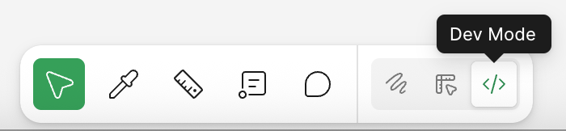
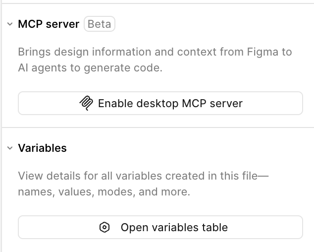
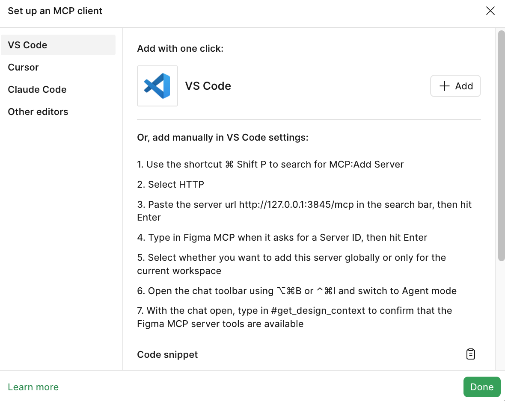
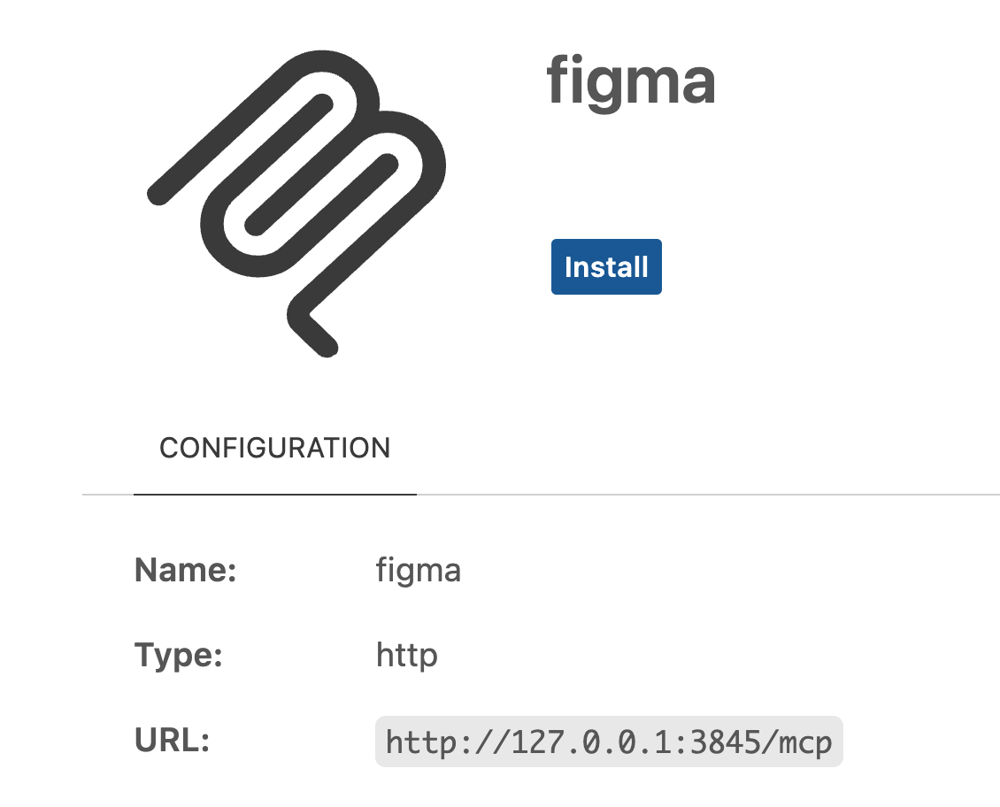
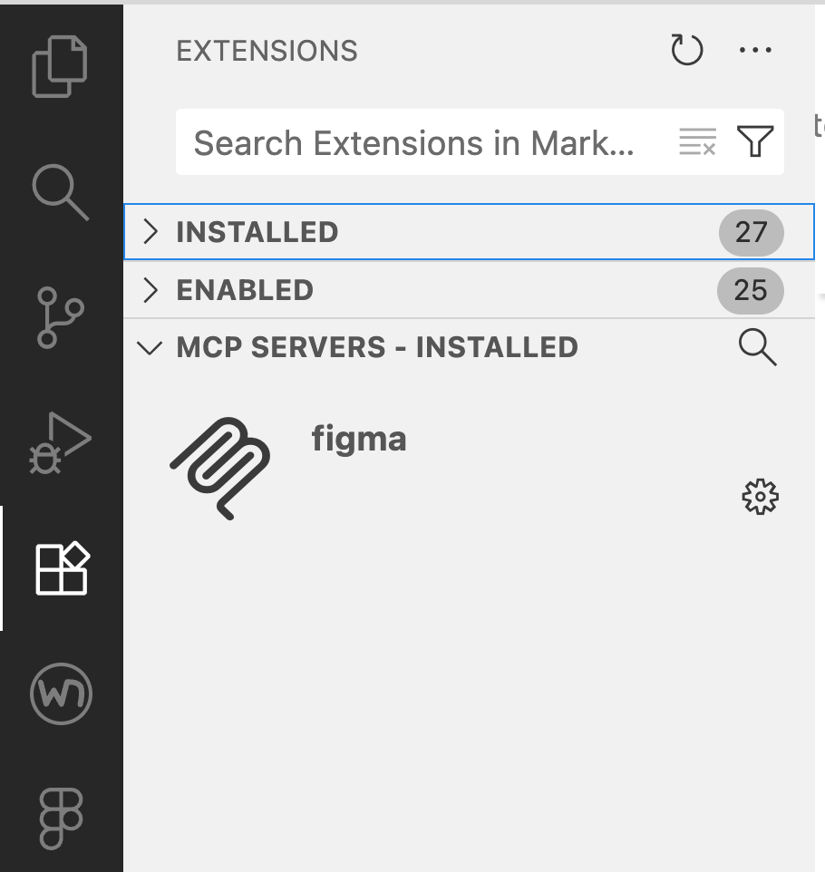

# FIGMA MCP SERVER #

## NOTES ##

- Figma MCP Server can better follow your Design instead of using default CSS and JS frameworks and Libraries (Tailwind, ShadnUI, React, Typescript).

- Using default libraries and frameworks makes it difficult to clean up and use your own design system, the code can often be messy spaghetti code.

- Figma MCP server acts as a bridge between your Figma design files and AI coding assistants, providing the AI with structured data like components, variables, and layout information instead of just a screenshot. 

- This allows AI tools to generate more accurate and relevant code that aligns with the design system. The server takes the design's structured data, such as components, variables, and styles, and exposes it to the AI agent.

- Model Context Protocol (MCP) allows AI Agents to access a broader collection of capabilities so that the AI can generate code that matches your team's established design patterns and codebases, rather than relying on visual interpretation of a screenshot, and default Libraries and Frameworks. This ensures the generated code is not only functional but also semantically aligned with the design's intent and specific design tokens. 

- This Leads to more precise and efficient code that is consistent with existing projects and design systems, bridging the gap between design and code. 


## PROCESS ##

- As of October 23 2025, the [Figma Help Centre](https://help.figma.com/hc/en-us/articles/32132100833559-Guide-to-the-Figma-MCP-server) says:

```
The Figma MCP server is currently in open beta. Some functions and settings may not yet be available. The feature may change and you may experience bugs or performance issues during the beta period. Usage guidelines and rate limits will be announced when our MCP server is generally available.

*** Who can use this feature*** 

Available on a Dev or Full seat on the Professional, Organization, or Enterprise plans

You must use a code editor or application that supports MCP servers (i.e. VS Code, Cursor, Windsurf, Claude Code)
```

## There are two ways to set up the MCP server ##

Depending on your needs the Figma MCP Server can be used as a `remote` or `local desktop server`.

***Local Desktop MCP server:*** Runs locally on your machine through the *Figma desktop app*. It's good for *individual, on-device workflows*, 

***Remote MCP server:*** Connects directly to Figma’s hosted endpoint at https://mcp.figma.com/mcp. It's  better for *distributed teams or automated processes*.

### Setting up the Local Desktop Figma MCP Server ###

- Open *Figma Deskop App* to ensure you're using the latest version



- Launch Figma, choose your Project where your Design System and Prototypes are living and go to `DEV MODE`



- In the right panel that appears when switching to `DEV Mode` locate the `Enable desktop MCP server`



- In the MCP server section of the inspect panel, click `Enable desktop MCP server`.

- A pop-up dialog appears. Make sure you've chosen your prefered Code Editor and read through. Click `+ ADD` if you want to enable it or add it manually following the steps listed.



- In your VS Code, a confirmation message appears asking you to install the Figma MCP Server.



After you install it, the Figma Server is listed in your VS Code Extensions under the `MCP SERVERS - INSTALLED` section.



## Prompts ##

- [This section from the Figma Developers site](https://developers.figma.com/docs/figma-mcp-server/tools-and-prompts/) has a section on how to prompt the MCP Server. The default output uses Tailwind and React, but you can explicitly customize the output with prompts.

- [This section has more info on writing effective promts](https://developers.figma.com/docs/figma-mcp-server/write-effective-prompts/)


## Reference ##

[From Figma Help file - setting up MCP Server](https://help.figma.com/hc/en-us/articles/32132100833559-Guide-to-the-Figma-MCP-server)

[Remote Server Installation](https://developers.figma.com/docs/figma-mcp-server/remote-server-installation/)


[Using the Dev Mode MCP server to help AI agents generate new component code.](https://player.vimeo.com/video/1107414637?h=4d588d37e0&amp;title=0&amp;byline=0&amp;portrait=0&amp;playsinline=0&amp;muted=1&amp;autopause=0&amp;loop=1&amp;app_id=122963)